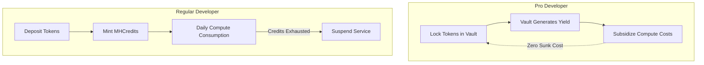
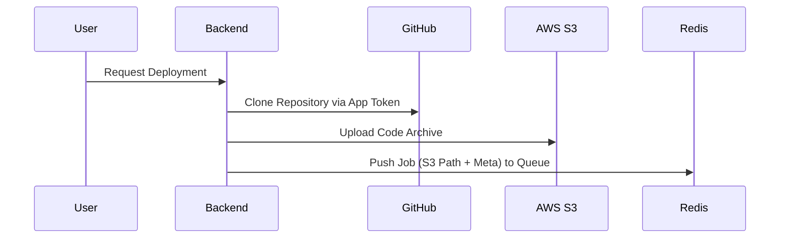
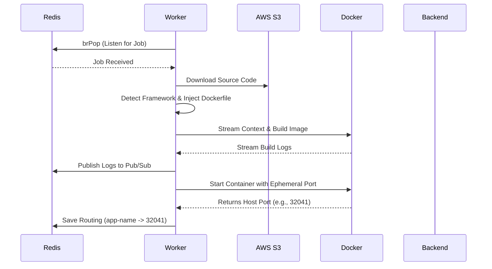
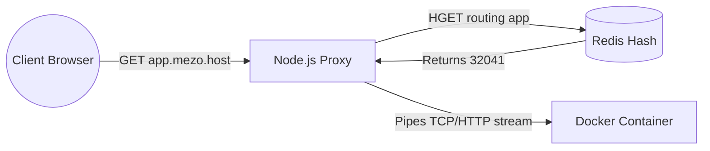

# Architecture & Platform Deep Dive

Welcome to the technical and conceptual deep dive of **Mezo PaaS**. This document explains the underlying mechanics of how the platform scales, how traffic is routed, and why the economic model of "Yield for Compute" fundamentally changes cloud hosting.

---

## 1. The Economic Model: Why "Yield for Compute" is Revolutionary

In traditional cloud computing (AWS, Vercel, Heroku), hosting is a continuous sunk cost. You pay monthly for the compute power you consume, permanently draining capital from your bank account. 

Mezo PaaS introduces a paradigm shift by leveraging **Decentralized Finance (DeFi) primitives on the Mezo Chain**.

### The Pro Developer (Zero-Sunk-Cost Hosting)
Instead of paying for servers out of pocket, a Pro Developer **locks tokens** (e.g., stablecoins or native Mezo tokens) into a Smart Contract Vault. 
1. The vault aggregates these locked tokens and deploys them into secure, yield-generating DeFi strategies (e.g., lending or staking).
2. The yield generated by the principal is systematically harvested by the platform to cover the real-world infrastructure and compute costs of hosting the application.
3. The developer's principal remains completely untouched. 

**Why it's revolutionary:** When a developer decides to take their application offline, they simply unlock their vault and retrieve 100% of their initial deposit. The hosting was effectively "free" (costing only the opportunity cost of the capital). This creates a risk-free environment for startups and indie hackers to deploy and scale applications without worrying about sudden, massive server bills.

### The Regular Developer (Pre-Paid Decentralized Credits)
For developers who prefer not to lock large amounts of capital, they can directly deposit tokens which are burned or locked in exchange for **MHCredits**. These credits act as prepaid gas for running applications, consumed on a daily basis. Once the credits are exhausted, the platform automatically halts the container.

---

## 2. The Upload Layer

The Upload Layer separates the platform's API from the raw execution of source code. 

**Workflow:**
1. **Authentication & Integration:** The user authenticates via their Web3 Wallet and links their GitHub account. The NestJS backend requests an installation token via the GitHub App integration.
2. **Repository Cloning:** When a deployment is initiated, the backend uses `Octokit` to clone the target repository to a temporary local directory.
3. **Immutable Storage (AWS S3):** Instead of passing git credentials around the system, the backend packages the cloned repository and uploads it to an **AWS S3 Bucket**. 
4. **Queue Dispatch:** The backend pushes a JSON payload containing the project metadata and S3 bucket path to a **Redis Queue**.

**Why it works:** By using S3 as a staging ground, the backend never exposes git tokens to the deployment workers. It ensures that workers are completely stateless and only need access to S3 and Docker.

---

## 3. The Deployment Layer

The Deployment Layer is powered by an independent, scalable Node.js/TypeScript Worker.

**Workflow:**
1. **Polling the Queue:** The worker listens to the `deployment-queue` on Redis using a blocking pop (`brPop`). When a job arrives, the worker is instantly activated.
2. **Code Retrieval:** The worker downloads the source code directly from AWS S3 to its local temp folder.
3. **Environment Injection & Dockerfile Detection:** 
   - A `detector.ts` script analyzes the root of the project. If it finds a `package.json`, it generates a Node.js/Next.js `Dockerfile`. If it finds `requirements.txt`, it generates a Python one.
   - Environment variables (decrypted on the fly) are injected into the generated `Dockerfile` as `ARG` and `ENV` statements so they are available during both build time and runtime.
4. **Containerization (Dockerode):** Using the Docker Engine API via `dockerode`, the worker streams the context to the Docker daemon. 
5. **Dynamic Port Mapping:** The worker asks Docker to bind the container's internal port (e.g., 3000) to an **ephemeral host port** (e.g., port 0). Docker finds the next available port on the host (e.g., 32041) and assigns it.
6. **Live Log Streaming:** As Docker builds the image layer by layer, the worker pushes these logs to a **Redis Pub/Sub** channel. The backend subscribes to this channel and streams it to the user's browser via Server-Sent Events (SSE).

**Why it works:** The worker is isolated. If a build crashes, it only crashes the worker, not the main API. Multiple workers can be spun up across different servers to build projects concurrently.

---

## 4. Request Handling & Dynamic Routing

Traditional deployments require a Reverse Proxy like Nginx to be reloaded every time a new service comes online. This is slow and prone to configuration errors during high concurrency. Mezo PaaS uses a **Dynamic Redis-Backed Reverse Proxy**.

**Workflow:**
1. **Memory State:** When the Worker successfully starts a Docker container, it discovers the ephemeral host port (e.g., 32041). It saves this to Redis under a Hash table: `hSet("routing", "app-name", "32041")`.
2. **Wildcard DNS:** The domain `*.mezo.host` is pointed entirely to the custom Node.js Proxy server.
3. **Instantaneous Routing:** 
   - A user types `https://app-name.mezo.host` into their browser.
   - The Node.js Proxy parses the host header (`app-name`).
   - The Proxy queries Redis for `app-name`. Redis responds in less than 1ms with `32041`.
   - The Proxy immediately pipes the HTTP/WebSocket request to `localhost:32041`.

**Why it works:** The reverse proxy is entirely stateless and configuration-free. There are no `.conf` files to write or Nginx services to restart. The moment a container is live and writes to Redis, it is globally available. If the container is killed (e.g., out of credits), the worker deletes the Redis key, and the proxy instantly returns a 404 or 503 error.
