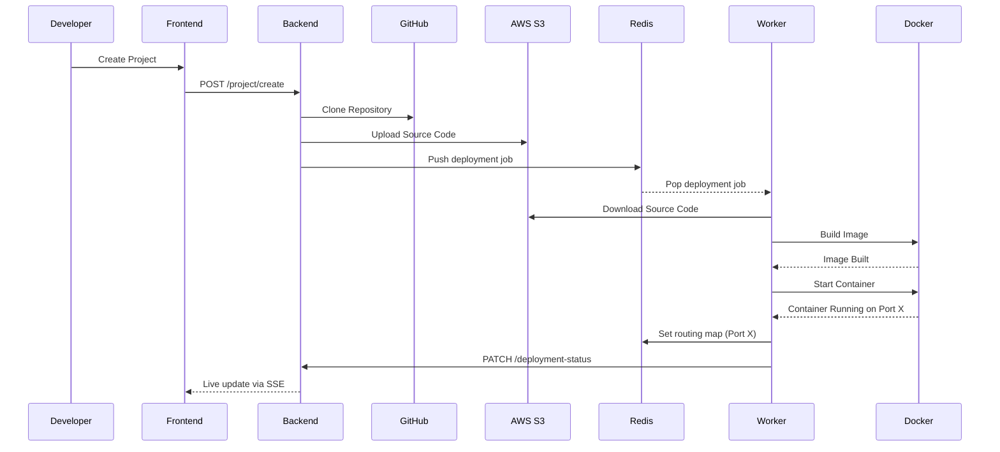
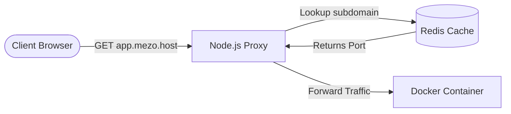
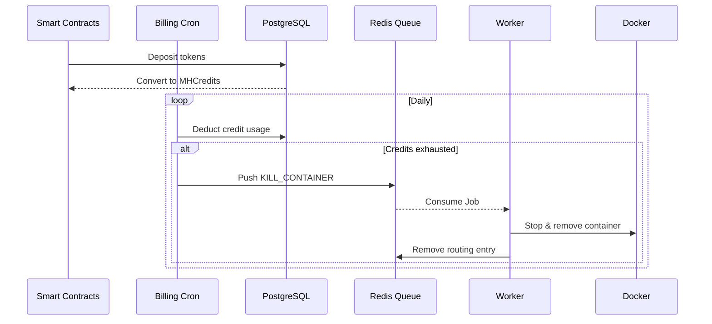

# Mezo PaaS

A decentralized deployment platform (PaaS) built on the **Mezo Chain**, enabling developers to deploy, manage, and scale their applications seamlessly while leveraging blockchain economics.

## 🚀 Overview

The platform caters to two distinct types of users:
- **Pro Developers**: Lock funds in a smart contract vault. The yield generated from these staked funds pays for their application hosting, effectively allowing them to run services for free.
- **Regular Developers**: Deposit tokens that are converted to MHCredits (1 credit = $0.001). These credits are consumed daily as their applications run. If credits run out, their services are automatically suspended.

## 🛠️ Tech Stack

- **Frontend**: Next.js, React, TailwindCSS, React Query, Socket.io / SSE
- **Backend**: NestJS, Prisma (PostgreSQL), Octokit (GitHub Integration)
- **Worker**: Node.js, TypeScript, Dockerode, Tar-fs
- **Proxy**: Node.js HTTP Proxy, Let's Encrypt (Certbot)
- **Smart Contracts**: Solidity (deployed on Mezo Chain)
- **Infrastructure**: Redis (Queue & Pub/Sub), Docker, AWS S3

## 🏗️ Architecture & Component Interaction

The platform operates through 5 core components working in tandem:

1. **Frontend**: The user-facing dashboard. It allows developers to authenticate via Web3 wallets, connect their GitHub accounts, create projects, view live build logs (via Server-Sent Events), and monitor credit usage.
2. **Backend**: The central API. It handles business logic, interacts with the PostgreSQL database via Prisma, manages GitHub repository imports, and orchestrates billing. It pushes deployment or kill-switch commands into a Redis queue.
3. **Worker**: The deployment engine. It listens to the Redis queue for new jobs. When triggered, it downloads the source code, dynamically generates a `Dockerfile` (for Node, Python, Next.js, etc.), builds the image, and spins up the Docker container. It publishes live build logs back to Redis.
4. **Proxy**: A custom dynamic reverse proxy. It listens for incoming web traffic on the host (e.g., `*.mezo.host`) and references Redis memory to route requests to the correct internal Docker container port.
5. **Contracts**: The financial engine on the Mezo Chain. It manages token deposits, mints MHCredits for Regular Developers, and handles the yield-generating vaults that subsidize Pro Developers' hosting costs.

## 📊 System Workflows

### 1. Upload & Deploy Pipeline
When a developer creates a project, the source code is securely fetched, stored, and sent to a background worker to be built into a container.


### 2. Request Handling (Dynamic Routing)
Incoming traffic to the platform's wildcard domain is dynamically routed in real-time without needing an Nginx reload.


### 3. Billing & Suspension
A decentralized financial engine powers the PaaS. If credits are exhausted, services are systematically suspended.


## 🏁 Getting Started

### Prerequisites
- Node.js (v20+)
- pnpm
- Docker
- PostgreSQL
- Redis

### Installation

1. **Clone the repository:**
   ```bash
   git clone https://github.com/osas2211/mezo-paas.git
   cd mezo-paas
   ```

2. **Install dependencies:**
   This project uses `pnpm` workspaces. Install dependencies from the root:
   ```bash
   pnpm install
   ```

3. **Configure Environment Variables:**
   Duplicate the `.env.example` file in the `backend`, `frontend`, `proxy`, and `worker` directories and fill in the required keys (e.g., Database URLs, Redis, GitHub App tokens, JWT secrets).

4. **Run the services locally:**
   You can start the services concurrently from the root or individually:
   - **Frontend**: `cd frontend && pnpm dev`
   - **Backend**: `cd backend && pnpm start:dev`
   - **Worker**: `cd worker && pnpm dev`
   - **Proxy**: `cd proxy && pnpm dev`

## 📄 License
MIT
